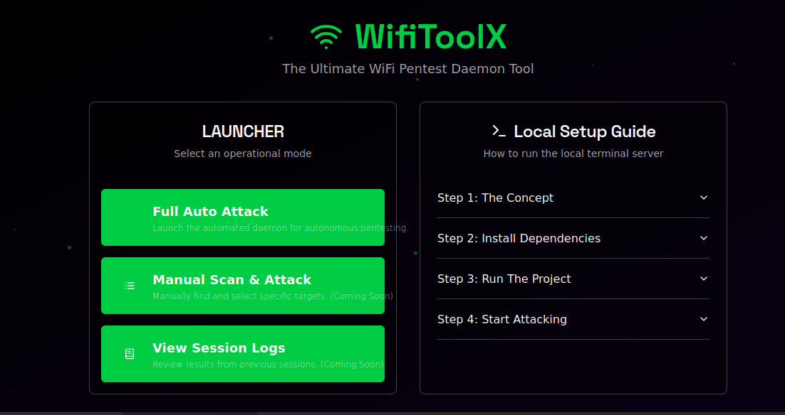

<div align="center">
  
  <h1 align="center">🧠 WifiToolX – Ultimate WiFi Pentest Daemon Tool</h1>
</div>

**WifiToolX** adalah dasbor antarmuka web yang canggih untuk mengotomatiskan dan mengelola serangan keamanan jaringan WiFi. Proyek ini secara unik menjembatani kenyamanan antarmuka pengguna grafis (GUI) modern dengan kekuatan eksekusi baris perintah (CLI) mentah, memungkinkan pengguna untuk mengontrol alat pentesting yang berjalan di mesin lokal mereka langsung dari browser.

Aplikasi ini bertindak sebagai "pusat komando" untuk **daemon serangan otomatis**, yang secara mandiri memindai jaringan, memilih target, menggunakan AI untuk menghasilkan kata sandi potensial, dan mengirimkan perintah serangan nyata ke server terminal lokal melalui WebSocket.

Dibuat oleh: **Mulky Malikul Dhaher** ([GitHub](https://github.com/mulkymalikuldhrs))  
Source Code: [WifiToolX Repository](https://github.com/mulkymalikuldhrs/WifiToolX)

---

## 🔩 FUNGSI UTAMA

| Komponen                 | Fungsi                                                                       |
| ------------------------ | ---------------------------------------------------------------------------- |
| **Antarmuka Web Modern** | Dasbor berbasis Next.js & React dengan desain *glassmorphism* untuk kontrol visual. |
| **Daemon Otomatis**      | Mode serangan "jalankan dan lupakan" yang secara otomatis menargetkan jaringan.   |
| **Integrasi Terminal**   | Terhubung ke server Python lokal melalui WebSocket untuk eksekusi perintah nyata. |
| **AI Password Generation** | Menggunakan Genkit dan model AI Google untuk menghasilkan kandidat kata sandi cerdas. |
| **Visualisasi Real-time**| Pantau jaringan yang ditemukan dan lihat log langsung dari terminal lokal Anda.    |
| **Logging Persisten**    | Otomatis menyimpan log sesi dan kata sandi yang berhasil di direktori `logs/`.   |
| **Alur Kerja Terintegrasi**  | Secara otomatis beralih ke target berikutnya jika serangan gagal, memastikan operasi berkelanjutan. |
| **Penyiapan Terpisah**   | Server frontend dan backend lokal dijalankan di terminal terpisah untuk stabilitas maksimum. |

---

## 🏗️ ARSITEKTUR

Aplikasi ini menggunakan arsitektur client-server yang cerdas:
1.  **Frontend (Client)**: Aplikasi web Next.js/React yang berjalan di browser Anda. Ini adalah antarmuka kontrol visual.
2.  **Backend (Server Lokal)**: Server WebSocket Python (`local_server.py`) yang Anda jalankan di mesin Anda. Server ini mendengarkan perintah dari frontend dan memiliki izin untuk mengeksekusi alat pentesting (seperti `aircrack-ng`, `reaver`, dll.) secara lokal.

Komunikasi antara keduanya terjadi secara real-time melalui WebSockets.

**Persyaratan Koneksi:**
- **Pembuatan Kata Sandi (Online)**: Langkah pemanggilan AI untuk menghasilkan kandidat kata sandi memerlukan **koneksi internet** untuk berkomunikasi dengan layanan Google AI.
- **Eksekusi Serangan (Offline)**: Eksekusi perintah di terminal lokal, logging, dan komunikasi antara UI dan server Python semuanya berjalan di `localhost` dan **tidak memerlukan koneksi internet**.

## 🔄 ALUR KERJA APLIKASI

1.  **Inisialisasi**: Pengguna menjalankan server frontend dan backend di dua terminal terpisah.
2.  **Koneksi**: Aplikasi web secara otomatis mencoba untuk terhubung ke server terminal lokal melalui WebSocket. Status koneksi ditampilkan di UI.
3.  **Mulai Daemon**: Halaman "Auto Attack" memulai siklus daemon:
    *   Meminta daftar jaringan WiFi (dengan mengirimkan perintah simulasi atau nyata ke backend).
    *   Memilih target yang valid (terenkripsi dan belum pernah diserang).
    *   Membuka panel serangan.
4.  **Serangan**:
    *   Aplikasi web memanggil AI untuk menghasilkan kandidat kata sandi berdasarkan SSID target (**memerlukan internet**).
    *   Perintah `crack_wpa` (atau yang setara) dikirim ke server terminal lokal melalui WebSocket.
5.  **Hasil**:
    *   **Berhasil**: Jika terminal melaporkan keberhasilan, pengguna akan diminta untuk memilih mode koneksi (Regular/MITM). Daemon dijeda.
    *   **Gagal**: Jika gagal, daemon akan menandai target sebagai sudah dicoba dan secara otomatis beralih ke target berikutnya.
6.  **Logging**: Semua output dari terminal lokal ditampilkan secara real-time di antarmuka web, dan juga disimpan dalam file log sesi di mesin lokal Anda.

---

## 🛠️ PENYIAPAN & INSTALASI

Untuk menjalankan proyek ini, Anda memerlukan Node.js dan Python 3 terinstal.

1.  **Kloning Repositori**:
    ```bash
    git clone https://github.com/mulkymalikuldhrs/WifiToolX.git
    cd WifiToolX
    ```

2.  **Install Dependensi**:
    Install dependensi Node.js dan Python.
    ```bash
    npm install
    pip install -r requirements.txt
    ```

3.  **Jalankan Proyek**:
    Anda perlu menjalankan server web dan server terminal di **dua terminal terpisah**.

    **Di Terminal 1 (Untuk Web UI):**
    ```bash
    npm run dev
    ```

    **Di Terminal 2 (Untuk Server Lokal):**
    ```bash
    python3 local_server.py
    ```

4.  **Buka Aplikasi**:
    Buka browser Anda dan navigasikan ke `http://localhost:9002`.

> **Peringatan Keamanan**: Server Python lokal (`local_server.py`) dirancang untuk tujuan pendidikan dan untuk digunakan dalam lingkungan yang terkendali dan tepercaya. **Jangan pernah** mengeksposnya ke jaringan yang tidak tepercaya karena dapat mengeksekusi perintah sewenang-wenang.
---

## 🤝 Contributing

Contributions are welcome! We encourage the community to help improve this project.

1. **Fork** the repository
2. Create a **feature branch** (`git checkout -b feature/amazing-feature`)
3. **Commit** your changes (`git commit -m 'Add amazing feature'`)
4. **Push** to the branch (`git push origin feature/amazing-feature`)
5. Open a **Pull Request**

Please make sure to update tests as appropriate and follow the existing code style.

---

## 📬 Contact

**Mulky Malikul Dhaher** — [mulkymalikuldhaher@email.com](mailto:mulkymalikuldhaher@email.com)

GitHub: [https://github.com/mulkymalikuldhrs](https://github.com/mulkymalikuldhrs)

---

## ⚠️ Disclaimer

**This project is for Education Purpose only.**

All content, code, and documentation provided in this repository are intended solely for educational and research purposes. Nothing in this repository constitutes financial, investment, legal, or professional advice.

**Risiko apapun tidak kita tanggung.** (We are not responsible for any risks or damages.)

Use at your own risk. The authors and contributors assume no liability for any losses, damages, or consequences arising from the use of this software or information provided herein.

---

## 📄 License

This project is licensed under the MIT License — see the [LICENSE](LICENSE) file for details.

Copyright © Mulky Malikul Dhaher. All rights reserved.

